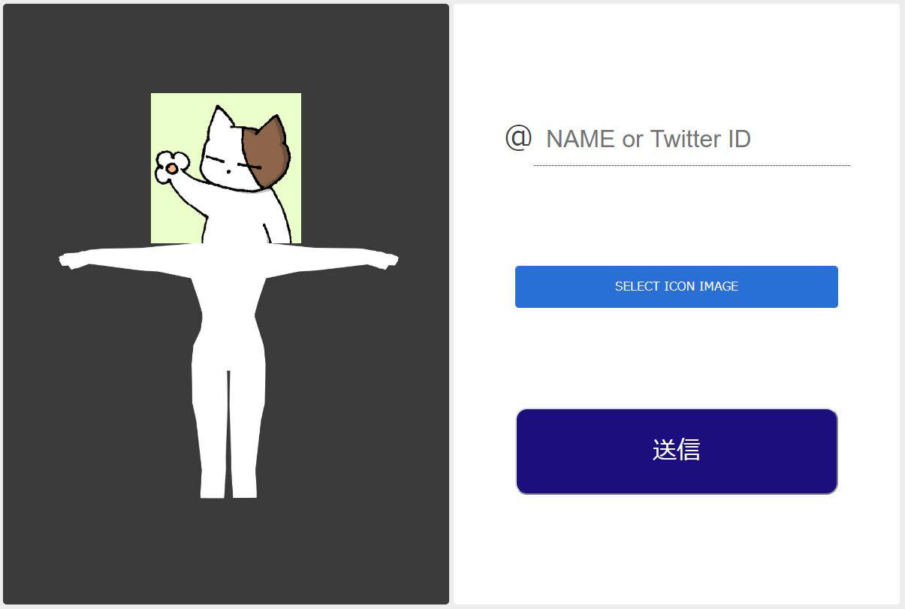

# vrm-icon-avatar-maker

## What is this?

You can launch webpage for making VRM file with icon


## How to use

```
yarn
yarn start
```

and open http://localhost:3000/


### thanks  
  [https://cubic9.com/Devel/OculusRift/VRChat/](https://cubic9.com/Devel/OculusRift/VRChat/)
